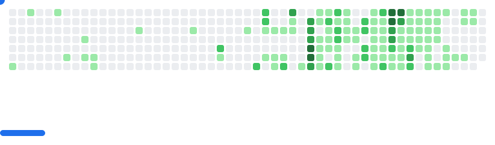
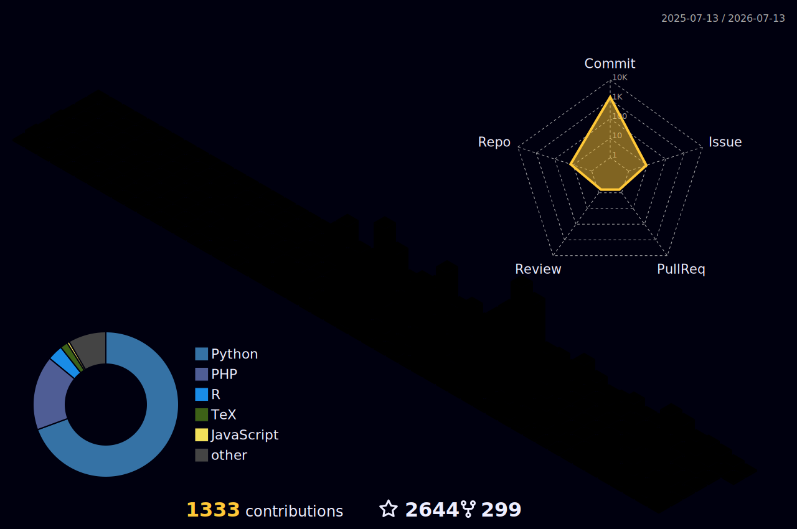

### 👋 Hi there

[)](https://git.io/typing-svg)

<!--  -->
<!--  -->

I am a bioinformatician specializing in cancer genomics and clinical data analysis. Working at the Department of General Surgery, Zhujiang Hospital, Southern Medical University, I am dedicated to applying bioinformatics methods to clinical research and advancing precision medicine.

As an R developer and open-source enthusiast, I believe in the power of technology to drive medical research forward. I am passionate about developing practical tools and templates that help researchers work more efficiently, making scientific research simpler and more beautiful.

Here are a few core principles I live by:

- **Learn for beauty** - Learning for the sake of beauty, maintaining a love for knowledge and pursuit of elegance, continuously advancing on the path of scientific research.
- Personal growth largely stems from **continuous learning** and **knowledge sharing**. I aspire to be a dedicated knowledge bearer—what I learn, internalize, and share should benefit others. That would be my greatest fortune!
- I am also someone who enjoys making friends. I maintain an open and friendly attitude toward everyone, whether familiar or new, hoping to connect with more like-minded individuals.

### 🤗 Welcome

 
[![Auth](https://img.shields.io/badge/Author-huangwb8-ff69b4.svg?logo=data:image/png;base64,iVBORw0KGgoAAAANSUhEUgAAADIAAAAyCAYAAAAeP4ixAAAACXBIWXMAAAsTAAALEwEAmpwYAAADZElEQVR4nO2ZX2iPURjHP/7/aZN/E21DaZvtwoVYyQUuGXLB/LtkLRcUhSJMSVwg3KCUJPJvLmRZtMQFLvwZhUJk/saGLWaYV6eet06n9/3tfd+9531/sW89td9z3vOc8z3nPOc8zzPoQQ+yAnlAA/AbcCzKR2ClTSL7LRNwNPkB5Noi0pggEQeYbovIh4SJLLBBojfwK2EiVTaIjEyYhANsskGkNAUi+2wQmZECkRM2iCxMgUi9DSKrxPhS7GOZjHXPhvGtYlwdMduYKWO9tmH8oBgvxj6KZawOoFfcxk+L8RzsI0fzkyFhO28EvqXg0FHlK1DtReRzFkzOCSmfvIhczIKJOSHlmheRgcAK4E4WTNDpQp4Ba4P4zxRgO3ArgSQqqDQDx4AKCWBDYwSwRTP4JWECG4CpQB9iwCTNsBsJl8srvxk4CtQBN4Enkre0GKQ7RaekCXgAXAcuAHuB1bLaZcAgrd+2uK78ai0PsfLSBshG70u9IDJmyUq2AYvlbD5N4Dg9l/EnArdFV9sdIlfEiLrNzFAlqPwE2kP2OaKNlyfH8Q9QFJVIixgepukqIuTdRRI3Be1TaczjnOgXRSXyTgwUarrBIVb4htbvcMA+nR7+UCdtc6MSOS8G9hj6+gjlnHEBd+WuMVaZ9FMyJiqRydrgB4B80VcFmFBtxALfFm3nlwPv48rfK7WoWDkc8jgpYq0eE/kOnAGG+4RBh3z6qTGOyzfIJeG2nQL6EQMmaEaTgtNdv+jKcFJwbI33XxEpAM76+IArrXIbFqVFpE0MuzeXF4nmEI9ecwZbhVo6GzsaxLhnniw74YQUVdDwwjppv2yzaPbIJ7HJdJz8RIX5JgYAL6V9vg0ifYEXMsAaj3Z3cpfkmPmhQAs5vHxgh+gbbdS0XMyTQdrkbdHhTiwTCdMHTCLl8hCqeGsalnFSO2JDNb3XxOZINqhkttFmfq8W4I1PbGcFuVr21qCloe7EarRvmzT9K01fYxAZJVmgA1yNKxwh4NF4q0Wr+UZs5JIxndskoVLoEskI1e/HRu6TCEpklR1ZebPcqk/YT9cu1UL190NgNCmhQGpfTjelLo2dMNEf2BkylXVF7eL6qAU3WyiVvCHIv7A7pBY2nizGWGC3FOr0XeoQZ96VIcbqAf8K/gLNGaTJ3vwbFgAAAABJRU5ErkJggg==)](https://github.com/huangwb8)

<picture style="width: 100%; display: block;">
  <source
    media="(prefers-color-scheme: dark)"
    srcset="images/breakout-dark.svg"
  />
  <source
    media="(prefers-color-scheme: light)"
    srcset="images/breakout-light.svg"
  />
  
</picture>

### 🏊 More Repositories

|     Category     |                        Project                         |                            Stars                              |                            Forks                             |              Remark              |
| :--------------: | :----------------------------------------------------: | :----------------------------------------------------------: | :----------------------------------------------------------: | :------------------------------: |
| AI | [ChineseResearchLaTeX](https://github.com/huangwb8/ChineseResearchLaTeX) |  |  | 🎓 LaTeX Templates for Chinese Research |
| AI | [skills](https://github.com/huangwb8/skills) |   |  | 🤖 Agent Skills Development Pipeline  |
| AI | [VibeNotification](https://github.com/huangwb8/VibeNotification) |  |  | 🔔 Vibe Notification System  |
| AI | [vibe-teaching](https://github.com/huangwb8/vibe-teaching) |  |  | 📚 Vibe Teaching Resources  |
| Research | [GSClassifier](https://github.com/huangwb8/GSClassifier) |  |  | 🧬 Gene Set Classifier  |
| Research | [CCS](https://github.com/huangwb8/CCS) |  |  | 🧬 Cancer Cell Line Classifier  |
| Research | [luckyBase](https://github.com/huangwb8/luckyBase) |  |  | 📦 R Bioinformatics Toolkit  |
| Blog | [m2w](https://github.com/huangwb8/m2w) |  |  | 📝 Markdown to WordPress Automation  |
| Blog | [bloghelper](https://github.com/huangwb8/bloghelper) |   |  | 🛠️ WordPress Blog Resource Tools  |
| Blog | [random-image](https://github.com/huangwb8/random-image) |  |  | 🎨 Random Image API Service  |
| Blog | [AutoSaleVPS](https://github.com/huangwb8/AutoSaleVPS) |  |  | 💰 VPS Auto-Sale System  |
| Others | [GRE](https://github.com/huangwb8/GRE) |  |  | 📖 GRE Learning Resources  |
| Others | [Grouper](https://github.com/huangwb8/Grouper) |  |  | 👥 Group Management Tool  |

### 🧰 Tech Stack

### 📝 Recent Blog Posts

<!-- BLOG-POST-LIST:START -->
- 🦍 [AI入门系列 Vibe Coding实战](https://blognas.hwb0307.com/ai/7035) 

- 🦄 [AI入门系列 一种实用的Prompt工程： Agent Skill](https://blognas.hwb0307.com/ai/7028) 

- 🥷 [AI入门系列 如何获得vibe coding相关的AI算力](https://blognas.hwb0307.com/ai/7008) 

- 🚦 [AI入门系列 配置vibe coding工具： VSCode+Claude Code+Codex](https://blognas.hwb0307.com/ai/7003) 

- 🐵 [AI入门系列 Mac：AI时代不容忽视的设备](https://blognas.hwb0307.com/ai/6994) 

- 💪 [开源项目与平台应用之争：OpenAI Prism vs. ChineseResearchLaTeX](https://blognas.hwb0307.com/other/6990) 
<!-- BLOG-POST-LIST:END -->

For more content, visit: [https://blognas.hwb0307.com](https://blognas.hwb0307.com)

